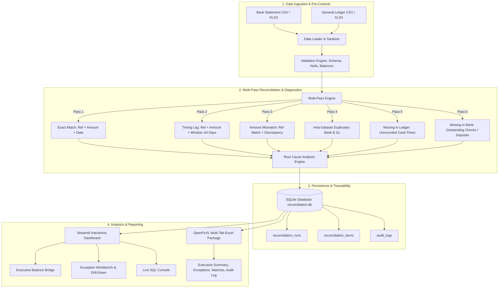

# Financial Reconciliation & Controls Dashboard

[](https://www.python.org/downloads/)
[](https://streamlit.io/)
[](https://www.sqlite.org/)
[](https://docs.pytest.org/)

An enterprise-grade, automated **Financial Reconciliation & Internal Controls** engine and interactive analytics dashboard built with **Python, SQL, Excel, and Streamlit**. 

Designed to process large transactional datasets, compare external bank statement records against company general ledger postings, detect subtle anomalies (transposition errors, timing lags, unauthorized fees, duplicate batch vouchers), diagnose root causes, maintain an immutable SQLite audit trail, and export audit-ready Excel reconciliation packages.

---

## 📌 Executive Summary & Resume Alignment

This project directly demonstrates core proficiencies in large-scale financial data engineering, accounting internal controls, automated testing, and interactive reporting:

* **Automated Reconciliation Pipeline:** Multi-pass matching engine comparing external bank clearing statements against enterprise general ledger postings to classify records as matched, missing, duplicated, or inconsistent.
* **Integrity Validation & Automated Testing:** Pre-reconciliation validation rules and a 19-test automated `pytest` suite ensuring schema compliance, balance equality, sign integrity, and discrepancy bounds.
* **Root-Cause Diagnostics:** Automated accounting heuristic tagger detecting digit transposition typos (divisible-by-9 rule), bank fee deductions, clearing transit lags, and duplicate voucher postings.
* **Interactive Controls Dashboard:** Streamlit executive portal featuring balance bridges, discrepancy trends, drill-down exception workbench, and live SQL query analytics.
* **Audit Trail & Governance:** Immutable SQLite database logging run metadata, record-level variances, execution timestamps, and user actions for Sarbanes-Oxley (SOX) and internal audit compliance.
* **Excel Reconciliation Package:** Automated generation of multi-tab, formatted Excel workbooks containing formal attestation certificates, variance schedules, clean match logs, and audit trails.

---

## 🏗️ Architecture & Pipeline Flow



---

## 🔍 Root-Cause Classification Rules

| Exception Status | Heuristic / Identification Logic | Root-Cause Category |
| :--- | :--- | :--- |
| **`MATCHED_EXACT`** | Identical Reference, exact Amount, exact Date | Clean Match (No Discrepancy) |
| **`MATCHED_TIMING_DIFF`** | Identical Reference & Amount, clearance within 1–5 days | `Timing Difference (Transit Clearing)` |
| **`AMOUNT_MISMATCH`** | Matching Reference, variance divisible by 9 | `Transposition / Data Entry Typo` |
| **`AMOUNT_MISMATCH`** | Matching Reference, variance matches fee pattern ($25, $30, etc.) | `Bank Surcharge / Service Fee` |
| **`AMOUNT_MISMATCH`** | Difference $\le \$0.05$ | `Rounding / FX Micro-Variance` |
| **`DUPLICATE_LEDGER`** | Identical Reference and Amount posted multiple times in GL | `Duplicate Voucher / Batch Error` |
| **`DUPLICATE_BANK`** | Identical Reference and Amount cleared twice by Bank | `Duplicate Bank Settlement` |
| **`MISSING_IN_LEDGER`** | Bank debit with fee keywords or direct transfer | `Bank Surcharge` or `Unrecorded Cash Flow` |
| **`MISSING_IN_BANK`** | Month-end checks or customer collections in GL | `Outstanding Check / Deposit In Transit` |

---

## 📁 Repository Structure

```
Financial-Reconciliation/
├── .gitignore                      # Git ignore rules
├── README.md                       # Comprehensive documentation
├── requirements.txt                # Python dependencies
├── config.py                       # Global tolerances, paths, and business rules
├── app.py                          # Streamlit interactive dashboard
├── reconciliation.db               # SQLite database (auto-generated on run)
├── data/                           # Data directory
│   ├── sample_bank_transactions.csv
│   ├── sample_general_ledger.csv
│   ├── sample_bank_transactions.xlsx
│   └── sample_general_ledger.xlsx
├── src/                            # Core pipeline source code
│   ├── __init__.py
│   ├── data_loader.py              # Ingestion, schema normalization & cleaning
│   ├── validation.py               # Pre-reconciliation controls & checks
│   ├── engine.py                   # Multi-pass matching & KPI calculation
│   ├── root_cause.py               # Diagnostic classification algorithms
│   ├── database.py                 # SQLite storage, audit logs & SQL analytics
│   ├── excel_exporter.py           # Multi-tab styled Excel report generator
│   └── sample_generator.py         # Realistic enterprise data generator
└── tests/                          # Automated test suite (pytest)
    ├── __init__.py
    ├── test_reconciliation.py      # Core matching algorithm tests
    ├── test_validation.py          # Data integrity and schema tests
    ├── test_root_cause.py          # Diagnostic classification tests
    ├── test_database.py            # SQLite and audit logging tests
    └── test_excel.py               # Excel report generation tests
```

---

## 🚀 Quickstart Guide

### 1. Clone the Repository
```bash
git clone https://github.com/manasvikhare19/Financial-Reconciliation.git
cd Financial-Reconciliation
```

### 2. Install Dependencies
```bash
pip install -r requirements.txt
```

### 3. Generate Sample Enterprise Datasets (Optional)
The project includes pre-generated realistic datasets (500+ records) with intentional accounting anomalies. To regenerate:
```bash
python -m src.sample_generator
```

### 4. Run the Streamlit Dashboard
```bash
streamlit run app.py
```
Open your browser at `http://localhost:8501`.

### 5. Run the Automated Test Suite
```bash
python -m pytest -v tests/
```
All 19 unit and integration tests will execute and validate the pipeline.

---

## 📊 Streamlit Dashboard Features

1. **Executive Overview:**
   - Real-time KPI summary: Match Rate (%), Discrepancy Rate (%), Net Variance ($), Gross Exposure ($).
   - Balance Reconciliation Bridge comparing total bank cash with general ledger cash balances.
   - Pre-reconciliation data integrity and schema validation status.
   - Formal control attestation and digital sign-off certificate preview.

2. **Exceptions & Discrepancies Workbench:**
   - Multi-parameter filtering by status (`AMOUNT_MISMATCH`, `DUPLICATE`, `MISSING_IN_LEDGER`, etc.).
   - Text search across transaction references and descriptions.
   - Variance amount threshold filter.
   - Side-by-side transaction inspector comparing Bank statement against General Ledger line items.

3. **Root-Cause Diagnostics & Trends:**
   - Pie/donut chart breaking down primary discrepancy drivers.
   - Histogram of bank transit clearing lag days.
   - Anomaly deep-dives into digit transposition typos and unrecorded bank service charges.

4. **SQL Analytics & Audit Trail:**
   - Canned executive SQL queries (Top 10 Largest Variance Breaks, Duplicate Ledger Entries, Daily Variance Trends).
   - Live interactive SQL Console allowing controllers to run custom read-only SELECT queries on the SQLite database.
   - Complete, immutable chronological audit trail tracking user actions and run parameters.

5. **Financial Reporting & Export Center:**
   - Download the multi-tab formatted Excel Reconciliation Package (`.xlsx`).
   - Download raw reconciled datasets and exception lists in CSV format.

---

## 📑 Multi-Tab Excel Reconciliation Package

The exported Excel workbook (`Financial_Reconciliation_Package_<RunID>.xlsx`) includes:
* **Tab 1: Executive Summary:** Reconciliation status certificate, balance bridge, discrepancy breakdown, and sign-off blocks.
* **Tab 2: Exceptions & Discrepancies:** Filtered list of all items requiring adjustment or investigation, formatted in currency with alert highlights and root-cause notes.
* **Tab 3: Matched Records:** Verified clean reconciliations for external auditor confirmation.
* **Tab 4: Audit Trail Log:** Timestamped log of execution events, parameters, and user attestations.

---

## 🛡️ Internal Controls & Audit Compliance

* **SOX 404 Traceability:** Every execution generates a unique `run_id` linked to the input filenames, checksums, and user identity.
* **Immutability:** Audit log entries are strictly append-only in SQLite.
* **Data Sanitization:** Robust handling of accounting formats including negative parentheticals `($1,200.00)`, credits `100.00 CR`, and varied date formats.

---

